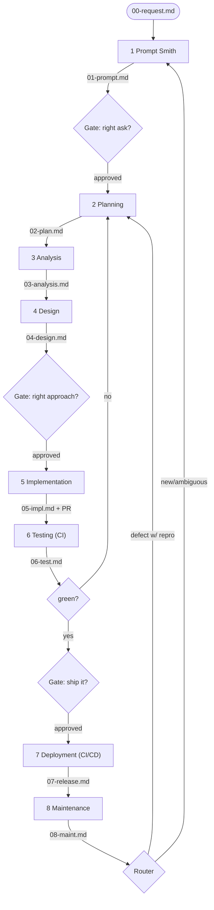

# SDLC Pipeline on Claude Projects — Architecture Reference

**Target:** solo developer · **Front door:** Stage 1 Prompt Smith (`sdlc-prompt-smith`), fixed and unchanged. Later phases consume its prompt; they never regenerate it.

## The one architectural fact

Claude Projects has no always-on server and no shared runtime between sessions. The only thing that survives a session is written documents. So every phase is a stateless worker that reads named docs, does its job, writes named docs, and updates one state doc. Nothing is carried in session memory; any phase can run cold.

Because Project Knowledge is human-curated and effectively read-only to the agent, the live artifact store is this repo's `pipeline/` folder, reached through a GitHub connector. Project Knowledge holds only the stable rules/templates (a copy of `CONDUCTOR.md`, `SCHEMAS.md`, `ROUTER.md`).

## Phase table

| Phase | Runs as | Consumes | Produces | Gate? |
|---|---|---|---|---|
| 1 Prompt Smith | `sdlc-prompt-smith` skill | `00-request.md` | `01-prompt.md` | Yes |
| 2 Planning | planner subagent | `01-prompt.md` | `02-plan.md` | optional |
| 3 Analysis | analysis subagent + GitHub | `02-plan.md` + repo | `03-analysis.md` | no |
| 4 Design | design subagent | `02-plan.md` + `03-analysis.md` | `04-design.md` | Yes |
| 5 Implementation | impl subagent + branch/PR | `04-design.md` | `05-impl.md` + code | no |
| 6 Testing | testing subagent + CI | `05-impl.md` + `04-design.md` | `06-test.md` | if red |
| 7 Deployment | deploy subagent + CI/CD | `06-test.md` + `05-impl.md` | `07-release.md` | Yes |
| 8 Maintenance | maintenance subagent + Issues | `07-release.md` + signals | `08-maint.md` | triage |

## Flow

## Risks / where this breaks

1. **Project Knowledge isn't machine-writable** → relying on it for live state goes stale. Mitigation: keep the writable store in this repo's `pipeline/` via the connector; Project Knowledge holds rules/templates only.
2. **No shared runtime → stale-state double-runs.** Mitigation: `STATE.md` is the single source of truth; every phase re-reads it and aborts if its phase ≠ `current_phase`.
3. **Testing/Deployment need real execution** web Projects can't do. Mitigation: delegate to GitHub Actions; the agent orchestrates and reads CI status rather than running it.

## Worked trace — `POST /users/:id/avatar`

Raw ask “let users upload avatars” → `REQ-2026-014`. S1 `01-prompt.md` (endpoint, auth, ≤5MB, storage, acceptance criteria) → S2 `02-plan.md` (milestones + criteria) → S3 `03-analysis.md` (usersRouter, multer missing, S3 config present) → S4 `04-design.md` (route contract, StorageAdapter, error cases, test plan) → S5 branch `feat/avatar-upload` + PR + `05-impl.md` → S6 `06-test.md` (CI green, 87% cov) → S7 `07-release.md` (v1.4.0, rollback) → S8 `08-maint.md` (finding: HEIC → 500 instead of 415) → Router: defect w/ repro → new `REQ-2026-021` at **Planning**. Every handoff doc exists; each input comes from the prior phase; the loop returns to Planning.
