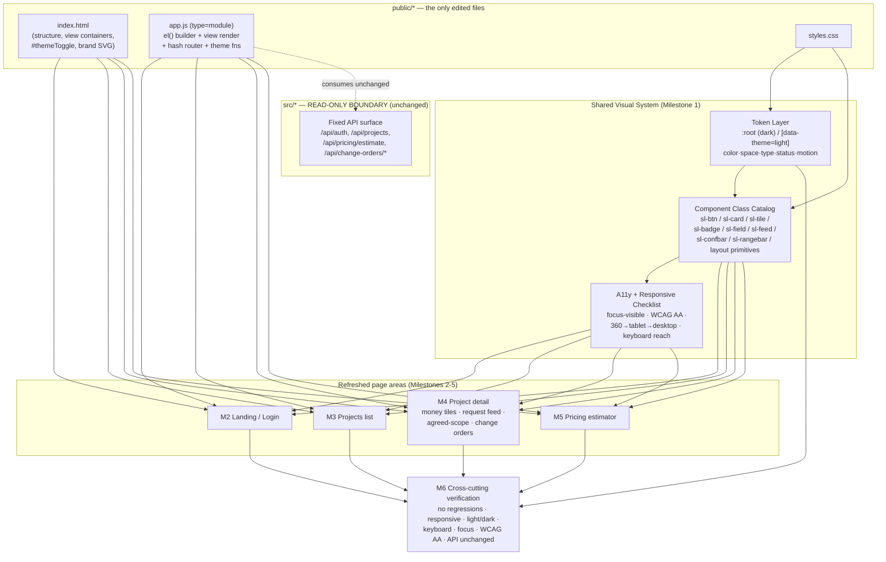

# 04-design.md — ScopeLine UI Refresh (REQ-2026-002)

Scope reminder: this is a **presentation-layer refresh only**, confined to `public/index.html`, `public/styles.css`, and `public/app.js`. The backend (`src/*`) is a read-only boundary. No backend, API, data-model, or schema change is designed or permitted here, and no third-party libraries, frameworks, build tooling, or new deps are introduced. Every decision below honors the must-use/must-avoid carried from the plan: **zero-dependency vanilla HTML/CSS/JS, no build, no backend**.

## Interfaces / API contract

### Consumed backend API — FIXED, unchanged (design input, not design output)

The design consumes the existing API surface exactly as-is. It is reproduced here only to bind the frontend rendering contract; **nothing in it is modified**.

- Auth: `/api/auth/{signup,login,logout,me}`
- Pricing: `/api/pricing/estimate`
- Projects: `/api/projects`, `/api/projects/:id`, `/api/projects/:id/{deliverables,requests,change-orders}`
- Entities: `/api/deliverables/:id`, `/api/requests/:id`, `/api/change-orders/:id`, `/api/change-orders/:id/export`
- Response shapes preserved verbatim, including `project.stats.{at_risk,on_orders,quoted,recovered,currency}` and request fields `classification`/`confidence`/`est_hours`/`overridden`/`reasons`.

**Contract rule for this stage:** `app.js` may re-arrange how these fields are *rendered*, but must read the same field names/shapes and must continue to POST/PATCH the same payloads. Any field the current code sends stays sent; any action (form submit, override toggle, export) keeps its current network behavior.

### New internal frontend interfaces (this is the actual design surface)

Because there is no backend API to design, the "interfaces" this stage owns are the **three internal contracts** that make a shared visual system possible in a no-build codebase:

**(A) Design-token contract** — a single namespaced CSS custom-property vocabulary declared under `:root` (dark, default) and overridden under `[data-theme="light"]`. Tokens are the *only* place raw color/spacing/type values live; every component class references tokens, never literals. Token families: color-role (`--sl-color-bg/surface/surface-raised/border/text/text-muted/accent/focus-ring`); status (`--sl-status-risk/order/quoted/recovered` each with a `-fg` companion, only ever used with icon + text label); spacing scale (`--sl-space-1..6`); radius/elevation/type scale; motion (`--sl-motion-fast/base`, gated by `prefers-reduced-motion` at usage sites). **Contract rule:** both `:root` and `[data-theme="light"]` MUST define the full set; a token resolving in only one theme is a defect (makes the "no unstyled/low-contrast element in either theme" criterion mechanically checkable).

**(B) Component-class catalog** — a fixed, documented set of BEM-ish class names emitted by `app.js`'s `el()` calls and `index.html` (the milestone-1 "reusable UI-element catalog"): `sl-btn` (`--primary/--ghost/--danger/--icon`), `sl-back-link`, `sl-card`, `sl-panel`, `sl-tile` (`__value`/`__label`), `sl-badge` (status `--risk/--order/--quoted/--recovered`, always icon-node + label-node), `sl-field` (label+input+hint+error slot), `sl-select`, `sl-check`, `sl-confbar`, `sl-rangebar`, `sl-px-big`, `sl-feed`/`sl-feed__item`, `sl-nav`, `sl-tabs`, and layout primitives `sl-stack`/`sl-cluster`/`sl-grid`. **Contract rule:** `app.js` keeps its `el()` builder and current DOM node identities/`id`s/event bindings; only class names and wrapper structure change. Existing hooks (`#themeToggle`, view containers, `VIEWS=['auth','projects','project','pricing']`, hash routes `#/p/:id`, `#/pricing`, `.hidden` view toggling) are preserved as-is.

**(C) Theme control contract** — unchanged public behavior: `applyTheme`/`initTheme`/`toggleTheme`, `data-theme="light"` on `<html>`, persisted in `localStorage['sl-theme']` (default dark), toggled via `#themeToggle`. The refresh reuses these; it does not introduce a competing theming mechanism.

### Significant decision — token file extraction vs. keep inline

- **Option 1 — Keep tokens inline in `styles.css`, delimited as a commented "Token layer".** Pros: zero new files/links, honors no-build/served-verbatim, matches existing "visual system v2" inline approach. Cons: no physical token/component separation.
- **Option 2 — Split into `public/tokens.css` + `styles.css` with a second `<link>`.** Pros: conceptual separation, easier diffing. Cons: extra file + HTTP request the static server must serve; cascade-order becomes load-bearing; no build to bundle back.
- **Option 3 — CSS `@import` from `styles.css`.** Pros: single `<link>`. Cons: serializes fetches (render delay); still adds a file.
- **Recommendation: Option 1.** Extracting a file buys clarity at the cost of the exact runtime characteristics the no-build constraint protects. Achieve the milestone-1 "standalone token layer" intent via a clearly delimited `/* === TOKEN LAYER === */` region at the top of `styles.css` — a logical token file without a physical one.

## Data / schema changes

**None. By design and by constraint.**

- No database schema change. `node:sqlite` (experimental, backend) is out of scope and untouched.
- No API request/response shape change. All consumed shapes (`project.stats.*`, request `classification`/`confidence`/`est_hours`/`overridden`/`reasons`, deliverables, change-orders, export) are read and written exactly as today.
- No new persisted client-state schema. The only persisted key remains `localStorage['sl-theme']` with its existing `light`/absent(=dark) contract; the refresh reuses it and does not add, rename, or repurpose keys.
- The "data" this stage introduces is purely the CSS-token vocabulary (Interfaces §A) and the class catalog (§B) — presentation contracts, not data schema.

Since this stage changes only the three `public/*` files, the "backend/data model/API unchanged" criterion is satisfied structurally — `src/*` and any migration path are outside the edited fileset (see Test strategy §Boundary check).

## Component diagram

Milestone → component mapping: **M1** → Token Layer + Class Catalog + A11y/Responsive Checklist; **M2** → auth view re-skinned; **M3** → projects view + `sl-grid`; **M4** → project view (`sl-tile` money tiles reusing `animateMoney`, `sl-feed` reusing `renderRequests`/`sl-confbar`/selects/checkbox, agreed-scope `sl-panel`, change-orders); **M5** → pricing view (`sl-px-big`, `sl-rangebar` reusing `calcPricing`); **M6** → VERIFY node. Every milestone maps to ≥1 component; none is blocked.

### Significant decision — closing the responsive gap below 900px

Today one breakpoint (`@media max-width:900px`); nothing targets ~360px.
- **Option 1 — Add discrete breakpoints (600px, 400px).** Pros: familiar, surgical. Cons: more query maintenance; easy to miss a view.
- **Option 2 — Intrinsic/fluid primitives** (`sl-grid` = `repeat(auto-fit, minmax(min(100%, <token>), 1fr))`, `sl-cluster` flex-wrap, `clamp()` type/space) reflowing continuously 360→desktop, keeping the 900px query only for a true mode-switch. Pros: one mechanism, no per-view bookkeeping, overflow prevented structurally, fewest new queries. Cons: needs disciplined use; less pixel-exact at named widths.
- **Option 3 — Container queries.** Pros: component-local. Cons: overkill for four areas; larger jump for a no-build refresh.
- **Recommendation: Option 2**, retaining the 900px query as the one explicit mode-switch. The `minmax(min(100%, …))` idiom is the standard guard against 360px horizontal overflow.

### Significant decision — `:focus` vs `:focus-visible`

Today focus is `:focus`-only and only on inputs; buttons/nav/tabs/cards/icon-btn/back-link have none; `:focus-visible` unused.
- **Option 1 — Extend `:focus` to all interactive elements.** Pros: universal support. Cons: shows rings on mouse click too (the regression we're fixing).
- **Option 2 — `:focus-visible` across all interactive elements via a `--sl-color-focus-ring` token, plus `:focus:not(:focus-visible)` reset where a legacy ring would double up.** Pros: keyboard users get a clear ring, mouse users don't; token-driven so it's theme-correct and AA in both themes. Cons: must audit every interactive selector.
- **Option 3 — Hybrid (`:focus` on inputs, `:focus-visible` elsewhere).** Pros: minimal churn. Cons: two inconsistent mechanisms.
- **Recommendation: Option 2** — standardize on `:focus-visible` + focus-ring token across the whole catalog (why focus is a catalog-level concern, not a per-view fix). No polyfill/dep needed for the target browsers (honors zero-dep).

## Error cases

1. **Theme token missing in one theme** → unstyled/low-contrast element. *Mitigation:* token contract requires the full set in both blocks; Test §Theme parity diffs the token lists.
2. **Contrast regression (WCAG AA).** *Mitigation:* every text-on-surface and status-fg-on-status pairing is fixed and listed; §Contrast audit checks each in both themes; status keeps icon+label so meaning never rests on color alone.
3. **Horizontal overflow at 360px.** *Mitigation:* fluid primitives `minmax(min(100%, token), 1fr)`; no fixed pixel widths on containers; §Responsive sweep checks 360/tablet/desktop.
4. **Focus not reachable / not visible.** *Mitigation:* catalog-level focus token + audit list; §Keyboard reach tabs through every view.
5. **Silent feature regression via re-skin** (class rename/wrapper change breaks a binding, submit, override, or export). *Mitigation:* Interfaces §B forbids changing node identities/`id`s/event bindings/payloads; §Behavior parity exercises each action.
6. **Backend contract drift** (reads/writes a renamed field or alters a payload). *Mitigation:* API consumed verbatim; §Boundary check confirms only `public/*` changed and field reads match fixed shapes.
7. **Motion for reduced-motion users.** *Mitigation:* motion tokens applied only inside `prefers-reduced-motion: no-preference` guards; existing `animateMoney` guard preserved.
8. **Cascade/specificity conflict** with leftover legacy selectors. *Mitigation:* single ordered `styles.css` (token → base → catalog → view overrides → media query); superseded legacy rules removed in the same pass.

## Test strategy

No test tooling exists and none may be added (zero-dep, no-build). The only automated visual path is `shots.mjs` (global Playwright, five fixed 1280×1280 shots, no assertions). Strategy layers a small mechanical check onto structured manual verification.

### Significant decision — visual-regression approach

- **Option 1 — Add a VRT/a11y tool (Playwright assertions, axe-core, Percy).** Cons: violates zero-dep/no-build. **Rejected on constraint.**
- **Option 2 — Extend `shots.mjs` in place: keep global Playwright, add viewports (360, ~768, 1280) × light+dark, still image-only.** Pros: closes the 360px + theme gap in the sanctioned harness without new deps; images become before/after eyeball diffs. Cons: still assertion-free; touching `shots.mjs` is outside the three UI files — flag at the gate.
- **Option 3 — Pure manual checklist, leave `shots.mjs` untouched.** Pros: zero code-surface risk. Cons: no captured 360px/theme artifact.
- **Recommendation: Option 2 primary, Option 3 checklist as backup.** Surface the `shots.mjs` change as a gate decision, not an assumption.

### Verification matrix (1:1 with M6 and every acceptance criterion)

- **Theme parity** — every token defined under both `:root` and `[data-theme="light"]`; scan all four areas in each theme for unstyled elements.
- **Contrast audit** — each text-on-surface and status-fg pairing ≥4.5:1 (body) / ≥3:1 (large/UI/focus ring) in both themes (manual calculator, no dep).
- **Responsive sweep** — all four areas at 360/~768/desktop; no horizontal scroll, no overlap.
- **Keyboard reach + visible focus** — Tab through every interactive element in every view; each stops in order and shows a `:focus-visible` ring meeting contrast.
- **Behavior parity / no regression** — exercise signup/login/logout/me, projects nav (`#/p/:id`), request override toggle + selects + checkbox, deliverables/requests/change-orders, change-order export, pricing `calcPricing`; same calls, payloads, results as before.
- **Boundary check** — diff touches only `public/index.html`/`styles.css`/`app.js` (and, if approved, `shots.mjs` harness-only); consumed field reads unchanged; no `src/*` edits, no new files/deps.
- **Visual comparison** — extended `shots.mjs` images reviewed before/after for each area × viewport × theme.

Every acceptance criterion has a satisfying design surface; every non-trivial choice records its rejected alternatives; every milestone maps to ≥1 component. Status set to `awaiting-gate`.
